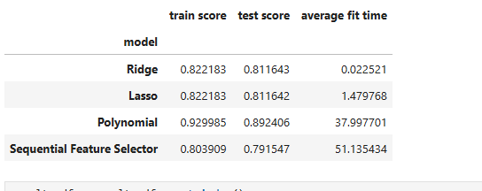

### Project Title
Predicting Life Expectancy Based on Longevity Factors
**Author**
Kwame Apraku
#### Executive summary
The business objective is to analyze the dataset of health data and its features to determine what features can be use to create the most optimal prediction model for predicting how long a person will live. In addition to determining the most critical features, the business objective is to determine what model performs the best in the prediction based on training time and accuracy score.
#### Rationale
This question is important because longevity is important.  Finding out the best set of features that will promote longevity and making lifestyle adjustments to correct dangers to ones health are very important.

#### Research Question
Can variables that control long life be used to predict how long someone will live, and can monte carlo evaluation be used to vary these variables to promote a healthier population.

#### Data Sources
https://www.kaggle.com/code/ahmedabbas757/life-expectancy-prediction Links to an external site. is the data source from Kaggle and contains 20 feature columns.

Country : Country
Year : Year
Status : Country Developed or Developing status
Life expectancy : Life expectancy in age
Adult Mortality : Adult Mortality Rates of both sexes (probability of dying between 15 and 60 years per 1000 population)
infant deaths : Number of Infant Deaths per 1000 population
Alcohol : Alcohol, recorded per capita (15+) consumption (in litres of pure alcohol) -percentage expenditure: Expenditure on health as a percentage of Gross Domestic Product per capita(%)
Hepatitis B : Hepatitis B (HepB) immunization coverage among 1-year-olds (%)
Measles : Measles - number of reported cases per 1000 population
BMI : Average Body Mass Index of entire population
under-five deaths : Number of under-five deaths per 1000 population
Polio : Polio (Pol3) immunization coverage among 1-year-olds (%)
Total expenditure : General government expenditure on health as a percentage of total government expenditure (%)
Diphtheria : Diphtheria tetanus toxoid and pertussis (DTP3) immunization coverage among 1-year-olds (%)
HIV/AIDS : Deaths per 1 000 live births HIV/AIDS (0-4 years)
GDP : Gross Domestic Product per capita (in USD)
Population : Population of the country
thinness 1-19 years : Prevalence of thinness among children and adolescents for Age 10 to 19 (%)
thinness 5-9 years : Prevalence of thinness among children for Age 5 to 9(%)
Income composition of resources : Human Development Index in terms of income composition of resources (index ranging from 0 to 1)
Schooling : Number of years of Schooling(years)

#### Methodology
The methodology is based on the following steps:

1. Understanding the Data by using visualization and summarizations of the data.  This will help understand the number of null values in the data and the correlation of the datas independent variables to the dependant variable

2. Data Cleaning and normalization:  Replacing null and empty values with averages or removing them entirely.  Performing Column transformation to get data into numerics, as it is obvious from the get go that the problems is a regression problem.
3. Splitting the data in to Train/Test for cross validation
4.  Creating a baseline Model using simple linear regression
5. Comparing this baseline model to SFS, Ridge, Lasso and Polynomial Feature using accuracy score and average fit time as the metric
6.  Using GridSearchCV to optimize all the models with selected hyper parameters
7.  Selecting the best model

#### Finding

Polynomial model was the best result with an accuray of 89%.  See Jupyter Notebook for graphs that compare accuracy score of both the test and train data.  The Neural Network was the lowest performing even given the use of a tunner.  500 Epochs were run on the the Neural Network Models.  

#### Next steps
Use Streamlit library to build a UI interface that can make predictions based on inputs.  Try to get the Neural Model to perform better by running more than 500 Epochs for the tunner and fitting of the model.

#### Outline of project

https://github.com/kwb332/capstone.git

##### Contact and Further Information
kwb332@gmail.comkj v 